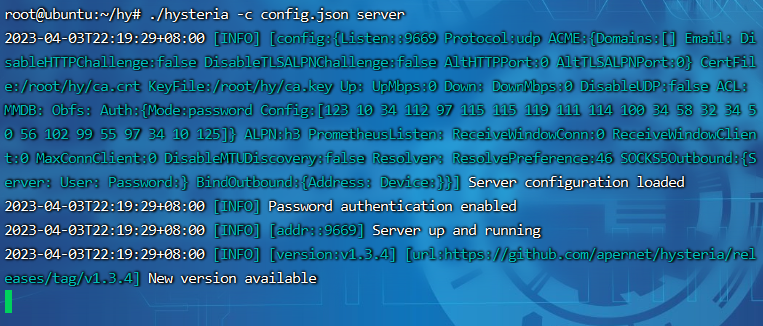
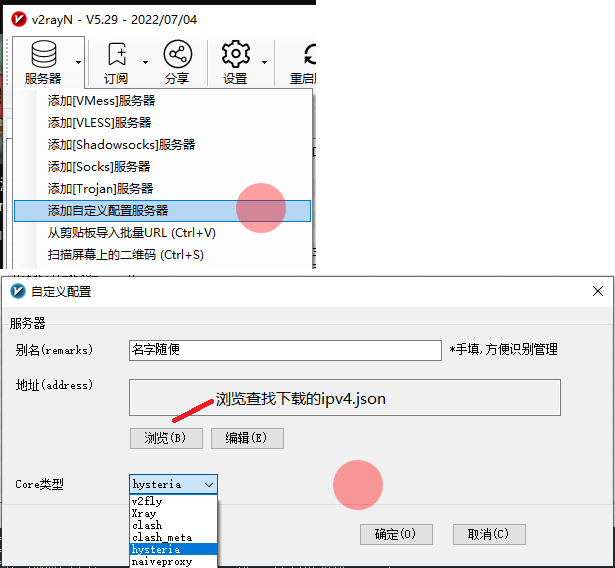

# hysteria.sh
hysteria.sh一键安装启动
#下载-赋权-运行脚本
```sh
wget https://github.com/lele1894/hy/releases/download/hysteria-ip/hysteria.sh && chmod 755 hysteria.sh && bash hysteria.sh
```
#脚本内容-新建/root/hy文件夹-自动检测架构下载对应程序到/root/hy-创建自签证书-创建服务端配置文件config.json并写入配置-创建客户端配置文件ipv4.json并获取ipv4地址写入配置ipv4.json

#cd到hy文件夹-运行
```sh
cd hy
./hysteria -c config.json server
```


/root/hy文件夹里生成的ipv4.json下载到本地，导入v2rayn.


